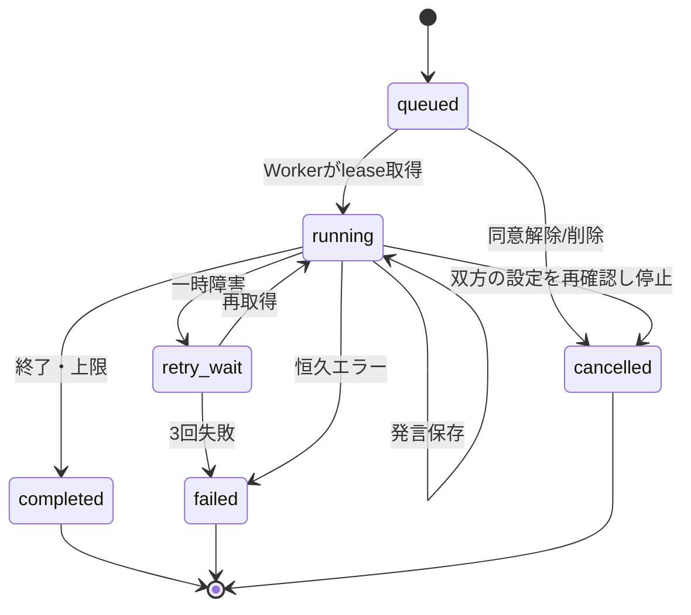

# 会話ジョブ状態遷移

```mermaid
stateDiagram-v2
  [*] --> queued
  queued --> running: Workerがlease取得
  queued --> cancelled: 同意解除/削除
  running --> running: 発言保存
  running --> retry_wait: 一時障害
  retry_wait --> running: 再取得
  retry_wait --> failed: 3回失敗
  running --> completed: 終了・上限
  running --> cancelled: 双方の設定を再確認し停止
  running --> failed: 恒久エラー
  completed --> [*]
  failed --> [*]
  cancelled --> [*]
```

`background_jobs`は処理状態、`conversations`は表示状態として同じ遷移に合わせる。再試行待機は`background_jobs.status=retry_wait`、会話は`running`のまま。詳細は [AI設計](../08-ai-agent-architecture.md)。
