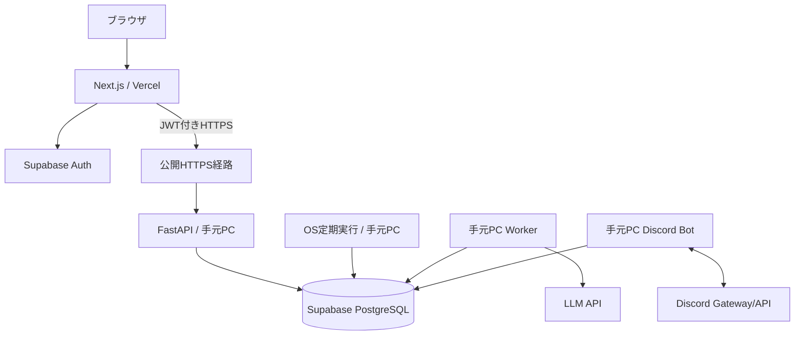

# 構成図

詳細な通信・障害復旧は [システム構成](../04-system-architecture.md)。

```mermaid
flowchart TB
  Browser[ブラウザ] --> Web[Next.js / Vercel]
  Web --> Auth[Supabase Auth]
  Web -->|JWT付きHTTPS| HTTPS[公開HTTPS経路]
  HTTPS --> API[FastAPI / 手元PC]
  API --> DB[(Supabase PostgreSQL)]
  Cron[OS定期実行 / 手元PC] --> DB
  Worker[手元PC Worker] --> DB
  Worker --> LLM[LLM API]
  Bot[手元PC Discord Bot] --> DB
  Bot <--> Discord[Discord Gateway/API]
```

WebはVercel Hobby、DB/AuthはSupabase Free。API・Worker・Bot・Schedulerは同じ手元PCで独立実行する。PC停止中はバックエンド全体が停止する。HTTPS経路の選定・疎通確認は #34 で行う。
