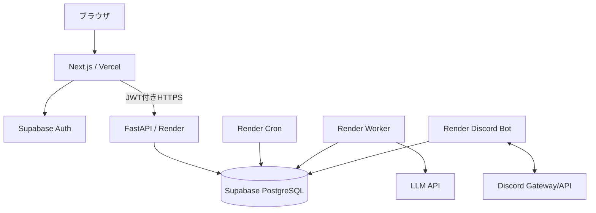

# 構成図

詳細な通信・障害復旧は [システム構成](../04-system-architecture.md)。

```mermaid
flowchart TB
  Browser[ブラウザ] --> Web[Next.js / Vercel]
  Web --> Auth[Supabase Auth]
  Web -->|JWT付きHTTPS| API[FastAPI / Render]
  API --> DB[(Supabase PostgreSQL)]
  Cron[Render Cron] --> DB
  Worker[Render Worker] --> DB
  Worker --> LLM[LLM API]
  Bot[Render Discord Bot] --> DB
  Bot <--> Discord[Discord Gateway/API]
```
