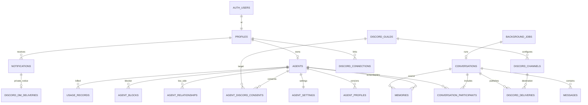

# ER図

カラムと制約の正本は [DB設計](../05-database-design.md)。図は主要FKを示す。

```mermaid
erDiagram
  AUTH_USERS ||--|| PROFILES : id
  PROFILES ||--o| AGENTS : owns
  AGENTS ||--o{ AGENT_PROFILES : versions
  AGENTS ||--|| AGENT_SETTINGS : settings
  AGENTS ||--o{ CONVERSATION_PARTICIPANTS : joins
  CONVERSATIONS ||--|{ CONVERSATION_PARTICIPANTS : includes
  CONVERSATIONS ||--o{ MESSAGES : contains
  CONVERSATIONS ||--o{ MEMORIES : source
  AGENTS ||--o{ MEMORIES : remembers
  AGENTS ||--o{ AGENT_RELATIONSHIPS : low_side
  AGENTS ||--o{ AGENT_BLOCKS : blocker
  PROFILES ||--o{ NOTIFICATIONS : receives
  PROFILES ||--o{ DISCORD_CONNECTIONS : links
  DISCORD_GUILDS ||--o{ DISCORD_CHANNELS : configures
  DISCORD_GUILDS ||--o{ AGENT_DISCORD_CONSENTS : target
  AGENTS ||--o{ AGENT_DISCORD_CONSENTS : consents
  CONVERSATIONS ||--o{ DISCORD_DELIVERIES : publishes
  DISCORD_CHANNELS ||--o{ DISCORD_DELIVERIES : destination
  NOTIFICATIONS ||--o| DISCORD_DM_DELIVERIES : private_notice
  AGENTS ||--o{ USAGE_RECORDS : billed
  BACKGROUND_JOBS ||--o| CONVERSATIONS : runs
```
